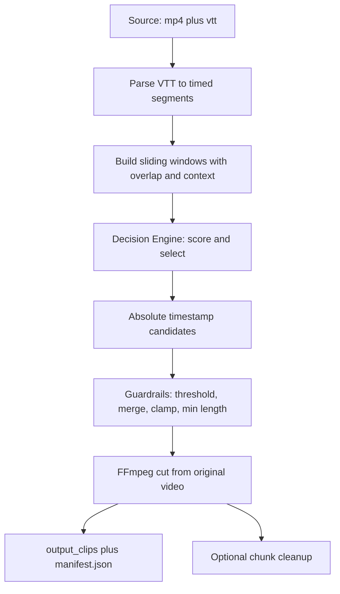
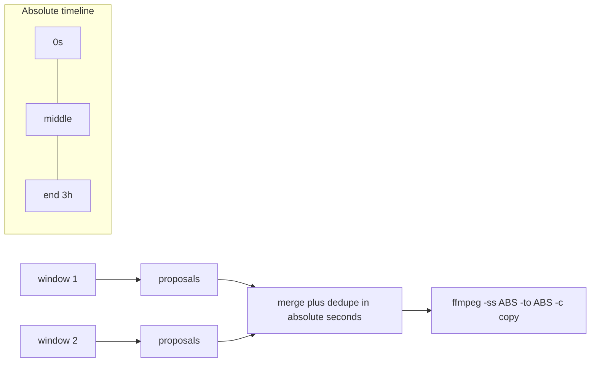

# AutoClip Jev-Engine — Architecture & Feasibility Analysis

> Historical analysis only. The authoritative product requirements are in the [Shera Clip PRD](../docs/PRD.md). Do not implement from this document where it differs from the PRD.

- **Document Version:** 1.0.0 (analysis of spec v1.0.0)
- **Status:** Draft for review
- **Scope:** Feasibility review, technical flaw audit, corrected architecture, trade-offs/ADRs, corrected cost model, risk register, and phased build plan.
- **Author role:** Architect
- **Verdict:** **Conditionally feasible.** The core strategy — *text-first decisioning + stream-copy cutting on CPU* — is sound and genuinely cheap. As written, however, the spec contains several load-bearing technical defects (transcript-to-chunk alignment, clip timestamp reference frame, lossless cut boundaries, cost math) and one unverified external dependency (the TypeSafe Jev API) that must be resolved before any code is written.

---

## 1. Executive Summary

The AutoClip Jev-Engine proposes to turn 2–3 hour recorded classes into 15–30 second distribution clips by splitting the problem into two halves:

1. **Content understanding (cloud, text-only):** get a transcript, ask an LLM to score/select high-value moments.
2. **Video rendering (local, CPU-only):** use FFmpeg stream-copy to cut selected moments without re-encoding.

This decomposition is the correct architectural instinct. Understanding *text* is ~1000x cheaper than understanding *video*, and stream-copy is the only way to cut video losslessly without a GPU. The design is honest about its constraints (no GPU, low budget, solo operator) and picks the cheapest tool at each step.

**However**, three things will break the current design as specified:

- **The chunk model is wrong for the decision engine.** Cutting first and mapping text back (FR-2 → FR-3) aligns transcript segments to 10-minute chunk *files*, but it throws away the context the model needs and makes clip timestamps chunk-relative rather than video-absolute. Decisioning should happen over a **sliding transcript window**, and cutting should happen on the **original full-resolution video** using **absolute** timestamps.
- **Stream-copy cannot cut at arbitrary 15–30s boundaries with frame accuracy.** Stream-copy can only begin at a keyframe (I-frame). 15–30s clips will frequently start late or clip the first words unless the source has a dense keyframe interval. This is a fundamental, non-negotiable video-format constraint that the spec does not acknowledge.
- **The cost and latency claims are idealized.** The cost table mixes a per-minute metric with a per-token metric, undercounts the number of Jev calls (it is not one call per 3 hours — see §7), and the "$0.003" figure depends on a token estimate that needs verification. "Sub-second per chunk" is plausible for a fast 1B-class model but must be measured, not assumed.

Recommendation: **proceed, but re-scope the core loop** per §4 (corrected architecture) and gate implementation on the verification checklist in §11.

---

## 2. Problem Statement Assessment

| Spec claim | Assessment |
|---|---|
| Traditional AI clippers (Opus Clip, Munch) are expensive black-boxes with per-video length caps | **Accurate.** Free/cheap tiers are typically capped in minutes and burn credits fast on long-form. |
| They lack domain-specific pedagogical logic | **Accurate and the real moat.** A generic "most viral moment" scorer is actively wrong for a teaching video; it surfaces drama, not the clean worked example a student needs. |
| They require costly server configs | **Partially accurate.** Cloud clippers hide the compute; that is convenience, not necessarily the user's cost. |
| A self-hosted, text-first pipeline is cheaper and more controllable | **Accurate for the *decision* layer**, but the spec undersells the *rendering* layer (see §5.3 on keyframes and §6.5 on the 9:16/subtitle phase). |

**Insight:** the defensible advantage is not "cheaper than Opus Clip." It is **a transcript-native, pedagogy-tuned selector that anyone can self-host and point at their own domain rubric.** Cost is a feature, not the product.

---

## 3. Requirements Analysis

### 3.1 Requirement quality review

| ID | Requirement | Verdict | Notes |
|---|---|---|---|
| FR-1.1 | Accept raw `.mp4` + `.vtt` | Clear | Good MVP path. Add: reject mismatched pairs (video duration vs transcript end time). |
| FR-1.2 | Zoom Server-to-Server OAuth pull | Clear, deferred | Correctly deferred. Non-trivial: OAuth handshake, pagination, download URLs expire. |
| FR-2.1 | Chunk to 10-min blocks with `-c copy` | **Flawed as the primary unit** | See §5.1. Chunking is a *storage/streaming* concern, not a *decision* concern. |
| FR-3.1 | Parse `.vtt`, strip tags, align to chunks | **Flawed** | Alignment target should be the *video timeline*, not chunk files. See §5.1. |
| FR-4.1 | Dispatch each chunk to Jev API | **Under-specified** | Payload shape, auth, retry, rate limit, batch vs sequential all undefined. |
| FR-4.2 | "Strongly typed questions" via Score/Choice | **Unverified primitive set** | Depends entirely on the real Jev API surface (§11). |
| FR-4.3 | Parse JSON with relative `start_sec`/`end_sec` | **Flawed** | "relative" → relative to *what*? Chunk-relative timestamps are the root cause of the alignment bug. |
| FR-5.1 | Confidence filter `> 0.8` | Acceptable | Threshold must be *calibrated*, not hardcoded to 0.8 blind (see §5.7). |
| FR-5.2 | FFmpeg lossless extraction to `/output_clips/` | **Flawed** | Stream-copy cannot be frame-accurate at arbitrary boundaries. See §5.2. |
| FR-5.3 | Garbage-collect processed chunks | Acceptable | Good, but unnecessary if you drop the chunk-file model (§4). |
| NFR-1 | CPU-only | **Valid** | Achievable for stream-copy and text APIs. |
| NFR-2 | ≤ $1.15 per 3-hour class | **Math error in source table** | "$0.006/min × 180" = $1.08, not stated cleanly; decision-engine call count understated (§7). |
| NFR-3 | Sub-second per chunk | **Unmeasured assumption** | Depends on model size, network RTT, and prompt length. Measure it. |

### 3.2 Missing requirements (gaps the spec does not cover)

- **R-G1 Output manifest.** No requirement to emit clip metadata (source video, absolute start/end, score, transcript snippet, rationale). Without this, output is unusable and unauditable.
- **R-G2 Idempotency / resume.** A 3-hour job that dies at minute 170 must not restart from zero.
- **R-G3 Observability & cost ledger.** Per-run token counts and dollar spend must be logged to prove NFR-2.
- **R-G4 Failure semantics.** What happens when a clip overlaps another, when Jev returns malformed JSON, or when a timestamp exceeds video length?
- **R-G5 Deduplication.** Overlapping/adjacent selected windows must be merged or rejected.
- **R-G6 Audio/loudness normalization.** Raw stream-copy cuts have no loudness leveling; distribution platforms normalize aggressively. Note for Phase 3, not MVP.
- **R-G7 Clip quality gates.** Minimum spoken content, no mid-word cuts, speaker must be talking (not silence/music).

---

## 4. Corrected Architecture

### 4.1 Core re-scoping (the central recommendation)

**Decouple the decision timeline from the storage chunks.**

- The **decision engine works on transcript windows over the full video timeline** (absolute timestamps), including neighboring context.
- The **cutter slices the original full-resolution video** (or a single full-length copy) at absolute timestamps.
- **10-minute chunk files are optional**, used only if the source itself must be streamed/fetched in pieces (e.g., Zoom API download limits) or to bound memory. They are a *transport* artifact, not a *logic* artifact.

This removes the entire class of "relative to which chunk" bugs and gives the LLM the context it needs to find a good teaching moment.

### 4.2 Corrected pipeline



### 4.3 Data flow with time reference frames



### 4.4 Proposed module layout (Python)

```
autoclip/
  ingest/        # file pair validation, optional zoom_api.py (Phase 2)
  transcript/    # vtt_parser.py, models.py (TimedSegment, Window)
  decide/        # engine.py (Protocol), providers/jev.py, providers/openai.py, providers/local.py
  guard/         # filters.py (threshold, merge, clamp, min-length, dedupe)
  cut/           # ffmpeg.py (probe, cut, optional transcode fallback)
  report/        # manifest.py, cost_ledger.py
  cli.py         # orchestration, resume, dry-run
config/
  default.yaml   # thresholds, model, window size, budget cap
tests/
```

---

## 5. Technical Flaw Audit

Severity: **Critical** (breaks correctness) / **Major** (breaks cost, quality, or scale claims) / **Minor** (polish).

### 5.1 CRITICAL — Chunk-relative timestamps destroy alignment

FR-2 chunks the video first, then FR-3 "aligns" transcript to chunks, and FR-4.3 returns `start_sec`/`end_sec` that are *relative*. A clip at chunk-003's 00:04:12 is video-absolute 00:24:12, but nothing in the spec defines or maintains that offset. Every clip after the first chunk is at risk of cutting the wrong moment.

**Fix:** Decision over absolute timeline (§4). If chunk files are retained, carry an explicit `chunk_offset_sec` and add it back at cut time. Never pass relative timestamps to FFmpeg.

### 5.2 CRITICAL — Stream-copy cannot cut at arbitrary boundaries

`ffmpeg -c copy` seeks to the nearest preceding **keyframe**. If the source GOP is, say, 2s and the video has keyframes only every 10s, a "start at 00:01:07.4" request will actually begin at the prior keyframe (up to ~10s early) or, with `-ss` before input, behave subtly differently than `-ss` after input. Two concrete failure modes:

- **Clip starts early** and includes unrelated audio.
- **Clip starts late**, truncating the hook — fatal for a 15s clip.

Additionally, `.mp4` with `-c copy` and a cut mid-GOP produces a file whose first frames may reference a missing keyframe (decoder artifacts / black frames) in some players.

**Mitigations (pick per situation):**
1. **Cheapest:** cut with a small pre-roll (e.g., start 0.5–1.0s before the desired in-point) and rely on the clip being slightly long.
2. **Correct:** two-stage — stream-copy a generous window (keyframe-aligned), then re-encode only that short window to exact boundaries. Re-encode of a 20s clip on CPU is cheap (seconds).
3. **Best quality/CPU balance:** re-encode the short clip to a normalized, keyframe-dense intermediate (`-g`), enabling exact cuts.

**Recommendation:** default to the two-stage hybrid (option 2). Exactness matters more than the last bit of CPU savings for a 20s artifact.

### 5.3 CRITICAL — No definition of the clip's reference frame

The spec never states whether `start_sec`/`end_sec` are relative to the chunk, the original video, or the transcript window. §5.1 and FR-4.3 both hinge on this. **Fix:** mandate `absolute_start_sec` / `absolute_end_sec` as the only boundary contract, validated against `ffprobe` duration.

### 5.4 MAJOR — Context window vs. chunk boundary conflict

A great teaching moment can straddle a 10-minute chunk boundary. Chunk-then-decide means the model sees half the moment in chunk N and half in chunk N+1, and may select neither or select a truncated one. **Fix:** sliding windows with **overlap** (e.g., 10-minute window, 1-minute overlap) and global merge/dedupe step.

### 5.5 MAJOR — Trusting LLM timestamps verbatim

Even with a correct window, LLMs are imprecise about exact seconds. A model may return a timestamp that lands mid-word or a range that is 8s when you asked for 15–30s.

**Fix:** Guardrails:
- Snap boundaries to the nearest **transcript segment/sentence boundary** (never mid-sentence).
- Clamp to `[0, duration]`.
- Enforce `min_duration` / `max_duration`; expand to the next sentence boundary to satisfy minimum.
- Merge overlapping proposals; drop near-duplicates.

### 5.6 MAJOR — `.vtt` parsing is under-specified

Zoom VTT is not plain captions: it contains `WEBVTT` header, `NOTE` blocks, cue identifiers, inline `<v>` voice tags, `<c.classname>` color/class tags, positioning (`align:`, `position:`), and sometimes overlapping/rolling cues. Naive stripping leaves artifacts.

**Fix:** a real parser (or a mature VTT library) that:
- Strips `NOTE` and metadata blocks.
- Removes `<...>` tag content but **preserves** the text inside `<v Speaker>` to retain speaker labels.
- Normalizes consecutive duplicate cues (rolling captions repeat text).
- Handles cue timestamps with `,` or `.` decimals and optional hours.

### 5.7 MAJOR — Hardcoded 0.8 threshold is uncalibrated

A confidence threshold is only meaningful if the model's scores are calibrated. Chosen blind, 0.8 may yield 0 clips or 60 clips. **Fix:** make it configurable, run a calibration pass on a labeled sample (10–20 known good/bad moments) and pick the threshold from a precision/recall trade-off. Log score distribution per run.

### 5.8 MAJOR — Cost model is internally inconsistent and undercounted

The source table lists Whisper as `$0.006/min × 180 = $1.08`. That equals **$0.006 × 180 = $1.08** only if the price is $0.006/min — correct arithmetic, but note the current OpenAI `whisper-1` price is **$0.006/minute**, so $1.08 for 180 minutes holds. The problem is elsewhere:

- The decision engine is described as "~$50k input tokens @ $0.042/M < $0.003" — one aggregate call. But the pipeline **must call the model once per window** (not once per video), and it must include **prompt + rubric + full window transcript + expected output schema** in *every* call. See §7 for the corrected count.
- Output tokens and any reasoning tokens are not counted.
- Retries on malformed JSON multiply the count.

**Fix:** see §7. Budget guardrail: hard-cap spend per run and abort gracefully.

### 5.9 MAJOR — "Sub-second per chunk" conflates per-call latency with total time

Sub-second **per API call** is plausible for a fast model. But total wall-clock for a 3-hour class is `calls × (latency + overhead)`, and a 3-hour class yields more windows than the spec implies. If the calls are sequential, total latency can reach minutes to tens of minutes. **Fix:** parallelize calls with bounded concurrency; measure p50/p95, not averages.

### 5.10 MINOR — No audio/content quality signal

A "high-value moment" can be a pause, laughter, or an off-topic aside. **Fix:** optionally weight selection by speaking-rate, keyword presence (IELTS vocab, "for example", "the trick is"), and non-silence.

### 5.11 MINOR — Disk space: GC timing

FR-5.3 deletes chunks "iteratively." If a window straddles two chunk files and one is deleted early, the slide needs that data. **Fix:** delete only after the window's proposals are committed to the manifest, or drop the chunk-file model entirely (§4).

### 5.12 MINOR — No deduplication of near-identical clips

Two adjacent windows may both select the same moment with 2s offset. **Fix:** merge by IoU/overlap ratio > some threshold.

---

## 6. Dependency & Novelty Risks

### 6.1 The Jev API is a single point of failure

The entire value proposition — "TypeSafe AI's Jev evaluates, scores and filters ... at sub-second speeds" — rests on `https://api.typesafe.ai/v1/systemone`. **This endpoint could not be verified from this environment.** Risks:

- If it does not exist or is not publicly available, the MVP has no decision engine.
- If it exists but its primitives are not `Score`/`Choice` as described (FR-4.2 uses terms that look like a specific vendor vocabulary), the payload design in FR-4.2/4.3 must change.
- Vendor lock-in: the product's core intelligence is rented from one unverified provider.

**Mitigation (already agreed):** abstract the decision engine behind a narrow interface (§8) and ship at least two adapters (Jev + a mainstream structured-output LLM). Verification is a **Phase 0 gate**.

### 6.2 "Novelty" claim

The architecture is not novel in a patent sense; it is a **well-targeted composition** of known techniques. That is fine and arguably better for a solo product. The differentiator to protect is the **pedagogical rubric and the guardrail layer**, not the plumbing.

---

## 7. Corrected Cost Model

### 7.1 Token math for a 3-hour class

- Speaking rate: ~150 words/min. 180 min → **~27,000 words**.
- English tokens ≈ 1.33 × words → **~36,000 tokens** of transcript.
- With overlap + prompt/rubric/schema overhead (~2,000 tokens/call), effective transcript tokens ≈ **40,000**.

**Call count.** Windows are ~10 min with ~1 min overlap → 180 min / 9 min effective ≈ **20 windows**. Add a second "refine" pass for candidate clips (~max 5 candidates/window → up to ~40 refine calls, or fold into one call) — assume **20 primary calls**.

- Primary call input ≈ 12 min of transcript (~2,400 words ≈ 3,200 tokens) + 2,000 overhead ≈ **5,200 tokens**.
- 20 calls × 5,200 ≈ **104,000 input tokens** (not 50,000). Output ≈ 20 × ~400 = **8,000 output tokens**.

### 7.2 Cost scenarios

Pricing inputs below are **illustrative and must be confirmed** at build time. Treat `$X/M` as a variable.

| Component | Basis | Illustrative unit | Est. per 3h class |
|---|---|---|---|
| FFmpeg chunk/cut | local CPU | $0 | **$0.00** |
| Transcript via Zoom `.vtt` | free | $0 | **$0.00** |
| Transcript via Whisper API | 180 min × $0.006/min | — | **$1.08** |
| Decision engine — cheap 1B class | ~104k in + 8k out | e.g. $0.04/M in, $0.16/M out | **≈ $0.0054** |
| Decision engine — mid-tier | ~104k in + 8k out | e.g. $0.50/M in, $1.50/M out | **≈ $0.064** |
| Decision engine — frontier | ~104k in + 8k out | e.g. $3.00/M in, $15/M out | **≈ $0.43** |
| Retries/overhead (+25%) | — | — | multiply above |

**Revised NFR-2 statement:** ≤ **$1.15** holds only in the **Zoom-VTT + cheap-model** configuration (≈ $0.01). With Whisper fallback the dominant cost is transcription ($1.08), not decisioning. With a **frontier** model, decisioning alone can exceed $0.40 and a 3-hour **4-hour** class would break the cap. The cap must therefore be expressed as a **function of (transcription source, model tier, video length)** — and enforced by a runtime budget guardrail, not asserted as a constant.

### 7.3 Budget guardrail (add as FR)

- Configurable `max_usd_per_run`.
- Accumulate real token usage from API responses; abort with a partial manifest when the cap is hit.
- Emit the total in the run manifest.

---

## 8. Corrected Decision-Engine Interface

Design goal: **the pipeline never knows which model it is talking to.** The Jev API, a mainstream LLM, or a local model all implement the same contract described in prose here (implementation belongs in Code mode):

```
Protocol DecisionEngine:
    decide(window: TranscriptWindow, rubric: Rubric, config: DecideConfig) -> DecisionResult

TranscriptWindow:
    text: str                      # window transcript with speaker labels
    absolute_start_sec: float
    absolute_end_sec: float
    segments: list[TimedSegment]   # for boundary snapping

DecisionResult:
    candidates: list[ClipCandidate]
    usage: TokenUsage              # for the cost ledger
    raw: dict                      # for auditing/debug

ClipCandidate:
    absolute_start_sec: float
    absolute_end_sec: float
    confidence: float
    rationale: str
    signals: dict                  # e.g. pedagogy tags
```

Adapters:
- `JevDecisionEngine` — maps the contract onto Jev's real primitives **once verified**.
- `OpenAIDecisionEngine` (or similar) — structured-output JSON schema; the default fallback.
- `LocalDecisionEngine` — optional; a small local model or even a rules/keyword scorer for zero-cost dry runs and tests.

Testing benefit: a `FakeDecisionEngine` returning canned candidates makes the guardrail, cutter, and manifest layers fully unit-testable **without any network or cost**.

---

## 9. ADRs (Architecture Decision Records)

### ADR-001: Decision over absolute transcript windows; chunking is transport-only
- **Status:** Proposed
- **Context:** Spec chunks first and passes relative timestamps; boundary-straddling moments are lost and offset bookkeeping is error-prone.
- **Options:**
  | Option | Pros | Cons | Complexity |
  |---|---|---|---|
  | A. Chunk files → relative timestamps (spec) | Simple streaming, bounded memory | Misalignment risk, lost cross-boundary moments, offset bugs | Low |
  | B. Absolute windows over full timeline | Correct, resilient, LLM sees context | Needs full timeline in memory (text only — cheap) | Low–Med |
  | C. Hybrid: chunk file + explicit offset | Keeps streaming | Still risks straddle loss, more invariants | Med |
- **Decision:** **B**, with optional chunk files retained only for I/O.
- **Rationale:** Text is tiny; the whole 3h transcript is ~36k tokens and fits trivially in memory. There is no reason to sacrifice correctness for memory.
- **Trade-offs:** Must store full-timeline segment list. Acceptable.
- **Consequences:** Positive — eliminates §5.1/§5.3/§5.4 bugs. Negative — must implement merge/dedupe. Mitigation — small, well-tested guard module.
- **Revisit trigger:** Zoom API forces segmented downloads with hard size caps (Phase 2).

### ADR-002: Two-stage cutting for exactness
- **Status:** Proposed
- **Context:** Stream-copy is not frame-accurate; 15–30s clips can start early/late.
- **Options:** (A) pure `-c copy`; (B) `-c copy` window + short re-encode; (C) full re-encode.
- **Decision:** **B** by default, with **A** available via config for source clips with known-dense keyframes.
- **Rationale:** Exact boundaries matter more than the marginal CPU of re-encoding ~20s.
- **Trade-offs:** Slightly more CPU and one more temp file. Acceptable on CPU-only.
- **Consequences:** Positive — correct, publishable clips. Negative — extra step. Mitigation — re-encode is bounded to the short window.
- **Revisit trigger:** Latency budget tightens and source GOP is demonstrated ≤ 1s.

### ADR-003: Provider-agnostic decision engine
- **Status:** Proposed
- **Context:** Jev API unverified; single-vendor lock-in risk.
- **Decision:** Narrow `DecisionEngine` protocol + adapters (Jev, mainstream LLM, local/fake).
- **Rationale:** Protects against §6.1 and enables zero-cost tests.
- **Trade-offs:** Slight abstraction overhead; must keep the contract the *intersection* of provider capabilities (structured output + scores) to avoid leaky abstractions.
- **Consequences:** Positive — swappable, testable. Negative — lowest-common-denominator features. Mitigation — a thin `extras: dict` escape hatch.
- **Revisit trigger:** Never; this is deliberately durable.

### ADR-004: Transcript-first (VTT) with Whisper as fallback
- **Status:** Accepted
- **Context:** VTT is free; Whisper costs $1.08/class.
- **Decision:** Prefer VTT; use Whisper only when no VTT exists.
- **Rationale:** Directly serves NFR-2.
- **Trade-offs:** Must build a robust VTT parser (§5.6). Acceptable.
- **Consequences:** Positive — near-zero cost default. Negative — parser edge cases. Mitigation — golden-file tests with real Zoom VTT fixtures.

### ADR-005: Manifest + cost ledger as first-class outputs
- **Status:** Proposed
- **Context:** Spec has no output metadata or spend tracking; NFR-2 is unprovable.
- **Decision:** Every run writes `manifest.json` (clips, absolute bounds, score, rationale, transcript snippet) and appends to a cost ledger.
- **Rationale:** Auditability, resume, dedupe, and cost verification.
- **Trade-offs:** Small extra schema to maintain. Acceptable.
- **Consequences:** Positive — reproducibility. Negative — schema versioning. Mitigation — `schema_version` field.

### ADR-006: GPU-free by construction
- **Status:** Accepted
- **Context:** NFR-1.
- **Decision:** No local inference; intelligence via cloud text APIs; video via CPU FFmpeg.
- **Rationale:** Meets hardware constraint and keeps cost near zero.
- **Trade-offs:** Network dependency and (small) per-call cost. Acceptable.
- **Consequences:** Positive — runs anywhere. Negative — offline mode impossible without a local fallback. Mitigation — `LocalDecisionEngine` for dry runs.

---

## 10. Risk Register

| ID | Risk | Likelihood | Impact | Mitigation |
|---|---|---|---|---|
| R1 | Jev API nonexistent / different primitives | High | Critical | Phase 0 verification gate; provider-agnostic interface (ADR-003) |
| R2 | Keyframe misalignment ruins clip boundaries | High | High | Two-stage cut (ADR-002); pre-roll; boundary snapping |
| R3 | Relative-timestamp bug cuts wrong moments | High (as specced) | Critical | Absolute-timeline decisioning (ADR-001) |
| R4 | Cost exceeds cap on long/frontier runs | Medium | Medium | Runtime budget guardrail; model-tier config |
| R5 | VTT parser mishandles rolling/edge cues | Medium | Medium | Golden-fixture tests; fallback to Whisper |
| R6 | LLM returns malformed JSON / bad timestamps | Medium | Medium | Schema validation, retry with repair prompt, clamp/snap guardrails |
| R7 | 0.8 threshold yields 0 or far-too-many clips | High | Medium | Calibration pass; configurable threshold; score distribution logging |
| R8 | Vendor lock-in to one model provider | Medium | High | Adapter layer; keep rubric/guardrails provider-neutral |
| R9 | Zoom API OAuth/download-URL expiry (Phase 2) | Medium | Medium | Deferred; design retrieve-and-persist-to-disk immediately |
| R10 | Disk exhaustion from temp files | Low | Medium | Drop chunk-file model; delete-after-commit; temp cleanup |

---

## 11. Assumptions to Verify Before Implementation (Phase 0 Gate)

These are **blocking**. Each maps to a risk above. Do not write production code until answered.

1. **Jev API reality** — Does `https://api.typesafe.ai/v1/systemone` exist, accept API keys, and return structured JSON? What are its actual primitives (not the assumed `Score`/`Choice`)? What is its real pricing, context limit, and latency? (R1, ADR-003)
2. **Chosen fallback model** — Which structured-output LLM is the second adapter? Confirm JSON-schema support, price, context window. (R8)
3. **Source encoding characteristics** — For a representative class `.mp4`: GOP/keyframe interval, codec, resolution, `ffprobe` duration. Determines whether ADR-002 option A is ever usable. (R2)
4. **Real Zoom VTT fixtures** — Collect 3–5 real `.vtt` files (rolling captions, speaker tags) as parser test fixtures. (R5)
5. **Pedagogical rubric** — Define what "high-value" means for IELTS teaching (worked example, exam tip, vocabulary set, error correction) and how it maps to a score. This is the product moat. (R7)
6. **Calibration sample** — Hand-label ~15 moments (good/bad) to calibrate the threshold. (R7)
7. **Cost cap** — Confirm the acceptable `max_usd_per_run` and default model tier. (R4)
8. **Clip contract** — Confirm target 15–30s, 9:16 out of scope for MVP, no subtitle burn-in for MVP. (Phase 3 scope)

---

## 12. Phased Build Plan

### Phase 0 — Verification & Scaffolding (gate)
1. Run the §11 verification checklist; record findings as `docs/architecture/verification-notes.md`.
2. Scaffold repo: `autoclip/` module layout (§4.4), `config/default.yaml`, `tests/`, `pytest`, lint config, CI.
3. Define domain models (`TimedSegment`, `TranscriptWindow`, `ClipCandidate`, `DecisionResult`) as the stable contract.
4. Implement `FakeDecisionEngine` and golden VTT fixtures to enable offline TDD.

### Phase 1 — Text Pipeline (no video yet)
5. Implement robust VTT parser (metadata/NOTE/tag stripping, speaker tags, rolling-cue dedupe) + tests.
6. Implement sliding-window builder with overlap + context, producing absolute-time windows.
7. Implement `DecisionEngine` protocol + first real adapter (Jev if verified, else the chosen LLM), with JSON-schema validation, retry, and repair.
8. Implement guardrails: threshold filter, boundary snapping to segments, min/max duration, overlap merge, dedupe, clamp.
9. Implement `manifest.json` + cost ledger writer (real token usage).
10. End-to-end text-only run on a real class transcript → produce candidate manifest, **before any cutting**.

### Phase 2 — Cutting & MVP CLI
11. Implement `ffprobe` wrapper (duration, keyframe interval detection).
12. Implement two-stage cutter (stream-copy window → short exact re-encode), with config to force pure copy.
13. Implement CLI orchestration: validate input pair, run pipeline, emit `/output_clips/` + manifest, support `--dry-run` (no Jev cost) and `--resume`.
14. Implement runtime budget guardrail (`max_usd_per_run`) with graceful partial output.
15. QA: verify clips are frame-accurate, not mid-word, correct duration; measure p50/p95 latency and real per-run spend; validate NFR-1/2/3 with evidence.

### Phase 3 — Hardening
16. Calibration tool + report for threshold selection; score-distribution logging.
17. Golden regression suite (fixed transcript → expected clip set) to catch prompt/model drift.
18. Robust error taxonomy, structured logging, and resumable job state.

### Phase 4 — Automation & Scale (deferred, FR-1.2)
19. Zoom Server-to-Server OAuth client: token handshake, `GET /v2/meetings/{id}/recordings`, download + persist to disk immediately (URLs expire).
20. Webhook/poll trigger on recording-complete; idempotent job creation.

### Phase 5 — Post-Processing (deferred, Roadmap Phase 3)
21. 9:16 reframe (crop/letterbox or face-tracking) and subtitle burn-in via a separate composition step; keep it out of the core MVP.
22. Optional loudness normalization on final clips.

---

## 13. Technology Recommendations (summary)

| Layer | Recommendation | Why |
|---|---|---|
| Language | Python 3.11+ | Best FFmpeg + API + testing ecosystem; solo-friendly |
| Video | FFmpeg (`ffprobe` + `ffmpeg`) | Free, CPU-only, scriptable |
| Transcript | Native Zoom `.vtt` → Whisper fallback | Cost |
| Decision | Provider-agnostic protocol; Jev adapter + one mainstream LLM adapter + fake | De-risk R1/R8 |
| Config | `default.yaml` (thresholds, model, window, budget) | Calibration and NFR enforcement |
| Output | `/output_clips/` + `manifest.json` + cost ledger | Auditability, resume, dedupe |
| Testing | pytest + golden VTT + fake engine | Offline, zero-cost TDD |

---

## 14. Bottom Line

- **Proceed.** The design philosophy is correct: cheap text intelligence + local CPU cutting is exactly the right shape for this problem and this operator.
- **But re-scope the core loop** to absolute-timeline decisioning and two-stage exact cutting (ADR-001, ADR-002). These two changes remove the design's most dangerous bugs.
- **Gate on Jev verification** (R1). If Jev is unavailable or different, the provider-agnostic interface (ADR-003) means the product still ships.
- **Fix the cost and latency claims** to be measured functions of configuration, enforced by a runtime budget cap — not asserted constants (NFR-2/3).
- **The real product is the pedagogy rubric + guardrails**, not the plumbing. Invest design effort there.
